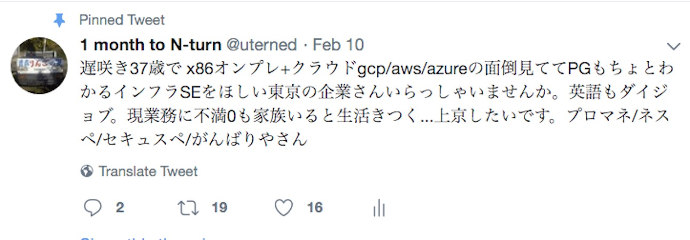

### はじめてのTwitter転職

@uterned

---

@size[small](

## 自己紹介

- @uterned
- 青森の37歳
- もとミュージシャン、DTM機器営業
- 2010年（２９歳）Uターンして青森でSIer常駐
- PHP書きながら4年でプロマネ、ネスペ、セスペ、TOEIC 860
- アメリカの格安大学の２年生
- レガシーチームにgitlab/bootstrap/dockerなど導入、勉強会、意識向上
 - → 今ではイケイケチームに！！

---

### 転職します

田舎のSIer常駐SEをやめ

8月からLINE株式会社さんのお世話になります

---

今日は

**「わたしはツイッター転職にこう取り組みました」**

を話したいと思います

---

## 目的

Twitter転職しようと思ってる人への情報共有

1. やってよかった？
1. ここ気をつけました
1. メリット・デメリット
1. インフラ勉強会も役に立った

---

## 大前提
「本気で転職する必要があった」ので

全力で取り組みました

（「とりあえず評価聞いてみたい」の役には立たないかも）

---

#### おねがい

今日は「転職する側」の方が多く聞いていると思いますので

「採用する側」の方がいらっしゃいましたら

ぜひ「うちはこうだなー」をチャットに書いていただけるとみんな喜ぶと思います！

---

早速ですが巻いていきます

スライド多すぎて時間オーバー間違いなし

---

#### なぜTwitter転職を？
1. エージェントで全敗

---
- 「落ちました」以外なにも教えてくれない

---
- 1mmでもいいから糧が欲しかった
 - (ooの経験が足りない、年齢がetc...)
 - 田舎気質100%の青森で、仙台のエージェント使ったのが悪かった？
- これで青森の求人は全滅
- 東京しかない・・・
  - 自分でやろうにも → 東京の会社知らない

---

### 「声をかけてもらおう」

---

## プロセス
- 2017/11 　転職決意
- 2017/12 　ひよこ大佐 転職成功
- 2018/01 　転職アカ作成、有名フォロワー作り
- 2018/2 　転職ツイート
- 2018/3〜5 　転職活動
- 2018/6 　LINE株式会社さんに決定

---

### ツイッター転職を知ったとき

やっぱりこれ

---

#### これが僕を奮い立たせた

---

##### こんなに優しい思いを無駄にはできない・・・！
この思いを形にしてあげたい・・・！という気持ちになりました

---

### 結論
ツイッター転職すげーいい

1. 履歴書・面接ポイントがわかる
1. 会社の雰囲気チョトわかる
1. 知り合いがいる感じ
1. リモート面接当たり前
1. 早い段階で給与・手当を聞ける
1. 質問しやすい

---

### 企業メリット

---

### 誰でもできるわけじゃない

ひよこ大佐の方法は `万人に通じない`

フォロワー数人でもできる方法・・・

---

## 募集ツイートへの応募

- 毎日山のような募集ツイートが流れています。
- ここに応募するのも、Twitter転職。
- **見栄えする資格がなくてもできます。	**
- *エンジニア 募集* で検索！

---

## わたしのツイッター転職

---

## わたしの転職戦略
1. 転職ツイートでもし声がかかれば、絶対受ける
1. 募集ツイートで惹かれるものがあれば応募する
1. Wantedlyというのひよこ大佐がやってたからやってみよう
1. HPなど見て良さげな企業があれば応募する

---

とりあえず、ひよこ式やってみよう・・・

---

## 転職ツイートの準備

1. 別アカ
1. 見られなければ意味がないので、フォロワーが必要
1. フォロワーづくり

---

フォロワーおらんで！！

---

### フォロワーづくり
バズったツイートを利用しよう

1. 有名人をフォロー
 1. ひよこ大佐さんのRT/フォロワーから適当に
1. バズりツイートをGET
 - 便乗コメントは多数の人の目に留まる
 - コメントでRTをもらうとフォロワーが増える
1. 技術系ツイートに技術コメント
 1. 技術の人がフォローしてくれる
 1. 技術系のバズったツイートはおいしい
1. お笑いツイートへのコメントして反応あると承認欲求満たされちゃうんだけど意味ないので我慢する

---

## 心得

 1. 転職アカとして節度は保つ（面接官が見てることは忘れない）
     1. でも面接官が「おっ○い！」とかツイートしてる
     1. 乗れる性格の方がうらやましい
1. 転職ツイートは 17 RT ゲット（アカウント作成から1ヶ月）
 - まだ下書きに20件くらい残ってる
 - RT/Likes本当にありがとうございました

---

## 転職ツイート

---

### 結果

- 37歳という年齢にも関わらず、5社からお引き合い
 - 4社に応募し、2社から内定
 - 1社は転職活動が終わってからDMに気付く...

みなさんには本当に感謝の言葉しかありません

特に2社さんは足を向けて寝られません

---

### よかったこと

- 即内定といってくださった方のおかげで今がある
 - → 給与をすぐ明示してくれた
 - 早々に転職できそうな可能性がわかった
- 声がかかるだけで自信がつく
- 37歳を受け入れる余地があるかもしれない会社がわかる
- イケそうな会社・業界・方向性がわかる
- 足を向けて寝られない

---

#### 募集ツイート

結果的にはこういったツイートに募集して決まった形

3社に応募し、うち1社から内定をいただきました

---

### よかったこと

- 生きている募集がわかる
 - （HP/エージェントのは古い募集、とか）
- 現場が欲しがってる募集はやりがいありそう
 - （上だけ欲しがってる現場は入っても不幸になりそう）

---

- 業務の情報が散りばめられている
- 自分がハマるかどうかを想定できる

- 他人が質問してくれる

---

### ツイッターだからわかること

---

1. 会社で扱ってる技術、プロダクト

1. 会社の抜粋プレスリリース

---

1. 職場全体のモチベ、雰囲気

---

1. 個人が持つ会社への思い（よい・悪い）

---

1. 休暇の取得状況

---
@size[medium](**GFRIEND**。2015年に韓国でデビューするや否や、優れた歌唱力と`パワー清純`と呼ばれている)

@size[medium](清純派ながらパワフルなダンスを武器に瞬く間に韓国トップアーティストの仲間入りをした。)

@size[medium](音楽番組で合計`29冠王`を達成。これは少女時代、Apinkに次ぐ記録である。2018年に日本デビュー。)

@size[small](引用： [GFRIEND、初の台湾コンサートが大成功！5千人のファンが熱狂！: ずっともっとMnet](http://jp.mnet.com/mobileweb/news/newsdetail.m?searchNewsVO.news_id=sseoul_26694))

---

1. どれくらい残業しているのか
 1. その方は終電ないと言っていても、他の方は全員定時帰りだったりもする
1. みなさんが日々どんな技術を開拓しているのか
1. どれくらい勉強家なのか

---

ただ、ツイートの受け取り方って人それぞれ

---

##### 同僚へのネガティブツイを見たら

#### あなたはどっち？

*「そんな会社行きたくないな」*

  or

  *「自分ならいい評価もらえるんじゃ」*

---

## Wantedly

- Profile書いて放置してただけだけど
- 読んだ上でのDMが定期的に来る（5-6通もらった）
- 2社とSkypeし、1社に応募、内定をいただきました
- ※スタートアップ企業多いのでSES脱却にいいかも

---

## HPなどで応募

ふつうのコトなので割愛

最後におまけ程度にやったくらい

---

##### 工夫したこと

---

速攻で

---

- 即履歴書で本気度を伝えた
 - お声がけいただく/募集ツイートを見る
       - *「よければ履歴書を見ていただけませんか」*
           - 顔写真、本名、住所など一切隠さない`本物`のレジュメ一式をtwitterのDMで送付
           - DMだめならdropboxのリンクを書き込んじゃう覚悟
               - クラウドサービスは相手が開いた後でも差し替えれるので素敵

---

#### 提出した書類
大前提：相手に合わせて書き換える。

1. **履歴書**
  - 学歴と資格を伝えるもの
2. **職務経歴書**
  - というよりも「プロジェクト経歴書」
  - 何系のプロジェクトをやったか伝えるもの

---

3. スキル年表
  - 何をどれくらいの期間やってきたのかを表にした

---

3. **スキルセット**
  - アピールは全部ここに書く
  - 人生の概略
    - 親が立派な仕事してる人はそこアピールしたほうがいいと思う
  - 今こんな仕事してます
    - こんな工夫してます、を書いた
    - 英語でぐぐります、とか
  - **これからやりたいこと**
    - 自動化したい・古いものを新しく置き換えたいって書いた

---

  - （つづき）
  - **スキル**
    - 何の言語でどのレベルのものを書けるのか、がみんなの関心事
    - dockerは技術開拓・本番運用しました、とか書いた
    - mysqlチューニングできないっす、も素直に書いた
  - **クラウド経験**
    - GAE運用して10年目、とか

---

      - （つづき）
  - おまけスキル
    - photoshop使えます、とか（この項目は一切の意味がなかった）
  - **実績**
    - チームにgit導入しましたとかサーバ削減しましたとか
  - アカウント
      - github, stackoverflowなど書けるもの全部書いた
  - **個人プログラム**
    - githubの公開ツール郡や、社内用に作ったテストツールなどの紹介
  - その他
    - 持ってる特許とか書いた

---

#### どうなった？

- みなさん本気で読んでくれた
- たくさんのアドバイスをいただいた
 - サポート経歴を強めに
 - もっとソウルあふれる感じで
- 「明日もう一回読んで返事しますね」など100%の方が親身になってくれた
 - それなのに落ちてごめんなさい 笑

---

- **履歴書の正式送付がスキップできた**
 - 「志望動機」は頭を悩ますもの
     - *「<本応募時に記入します>」*で一瞥してもらう
     - そのまま*「人事に回しておきますね」*となった例が多かった（楽！）
- エンジニア募集は`志望動機より技術重視`
 - 求める技術を持ってるのに動機不一致で落とすシーンってどれくらいある？

---

- 履歴書を書き直す時間が増えた
- 事前添削 最高
- 企業さんも嬉しいらしい
 - 「履歴書を早く見れるなんて珍しいので、嬉しくて」by 社長さん
- 面接が「○○さんと知り合いなんですね」から始まる
 - ツイッタラーとの距離が遠いほど効果的？

---

#### 反省点

- 書いた量が多すぎた
  -  読まれないのは想定内なんだけど、
  -  相手に合わせて書き換えるのが大変すぎ
  - 漏れが発生、支離滅裂に
    - サポートに応募してるのに顧客対応のアピールが抜ける、とか

---

### 途中で始めたこと

疲れたので、資料に更新日付を書かないようにした

Excel管理時代の悪しき慣習では？と思い至った

---

#### インフラ勉強会
- インフラ勉強会でセッションを開いた
    - @size[x-small](3/8 レミオロメンのECS など)
- わたしの技術レベルの確認に使ってもらった
    - 「このレベルなら十分」
    - 「ちょっと・・・」
- インフラ勉強会上でお声がけいただいたことはなかった
    - もっとがんばらねば
- 履歴書に盛れる
    - プラスの影響しかなかったのでは

---

#### twitter転職は企業の踏み絵？

1. Skype面接をお願いした
 - 青森にいるので行くの大変
- 「初めてなんです」という企業さん多数
- 企業さんの社会適応力がわかる
    - みなさんOKしてくれた
- Twitter/wantedly転職だと、リモート面接を検討してくれる

---

#### 起こったこと
1. お声がけいただいた方はほぼ面接官
1. みなさんフレンドリー
    - お互いにツイートを知っているので話が早い
1. でも当然落ちることはあります
	-  「ツイッターで引き続き情報交換しましょう」
	-  知り合い期間＝信頼度→いつか役に立つ
1. わたしの技術 + 既存現場への落とし込み方法など細かいことを聞かれる
 - それ面接じゃなくて、ただ知りたいだけじゃない？と思ったり...（で落とされる）
 - 技術者が声がけしていると起こりがちなのかも、と思った

---

#### なにが起こった？

1. お声がけいただいた方とは全員飲んだかも
 -  面接より先に飲んだ人も
 -  聞きたいことがいろいろ聞ける
     -  話を聞いていると「あ、そういえば」質問が浮かぶ
1. たくさんの魅力的な方に出会えた
    -  たぶんずっとお付き合いさせていただけるんじゃないかと思ってる
1. 「こんなすごい人と話せてる」が生きる希望になる
1. Twitter転職の魔力すごい・・・

---

#### やってわかったこと

1. いざ内定をもらい始めると、ツイートしにくい
 -  返答保留中に「面接受けてきました！」ツイートする勇気はなかった
 -  人を知ってみんなを好きになって一緒に働きたいと思えば思うほど...
 -  誰もそれを咎めないだろうけど、でもいい気持ちはしないよな、と思ったので

---

## いま思うこと

1. twitter応募している企業さんは、みなさんオープン
1. 今日このセッションで名前出していいですか？にもokしてくださることばかり
1. みなさん一生仲良くしてください

---

### 向いてる人は限られる？

- 採用可否はあくまで技術力ベース
 - 資格、学歴、経験が大事なのは変わらない
- 企業も転職者も、オープンな感覚が大事
- ツイートの裏を読み取る力
- アピールできるのは「やる気」
 - 日頃からの学習ツイート
 - 面接や履歴書では伝わらない「本当のモチベーション」

---

### Twitter転職（ひよこ式）が向いている人

やる気ツイート

技術ツイート

継続的にできる人

---

### Twitter転職（こっちから応募するタイプ）が向いている人

普通の転職と一緒

中の人の情報がある分、ツイッター転職のほうがいいことが多いと思う！

気軽に話しかけられる/質問できる人

ノイズになることもあるかもね

---

# 終わりに

---

#### なぜ人材不足？

---

- 大学のmacroeconomicsで各国のGDP変化を学んだ
 - すべては予測通りに動いている
- 日本は人口減への企業側の適合が追いついておらず、人材不足

---

- 日本の人口（食べ物が欲しい人）
- はたらく人の数（食べ物を作れる人）
- 　↓
- 人口は多いのに、はたらく人が足りない！
  - この差が **人材不足**

---

 - 来年の仕事を見込んで人を取る（未来予測）ため、人口減と労働市場の変化タイミングがずれる
 - ズレはいつか解消される（来るはずだった仕事が来ない！内定取消！）
 - 遅くなるほど不利になる
- ***わたしは2018年中にすると決意**
 - 面接中に「最近応募増えてますね」を何度か聞いた

---

- はたらく人の不足が2020年に最大になる
 - 差が縮まれば、人材は不要になっていく

@size[small](引用：http://restrer.atgj.net/Entry/178/ ※グラフがわかりやすかっただけで記事は無関係です)

---

- 寄って離れてを繰り返す例

@size[small](引用：http://d.hatena.ne.jp/abz2010/ ※グラフがわかりやすかっただけで記事は無関係です)

---

---

---

急いだ方が・・・いいかもね？

---

もしよければ、一緒に働きましょう

---

ご清聴ありがとうございました
